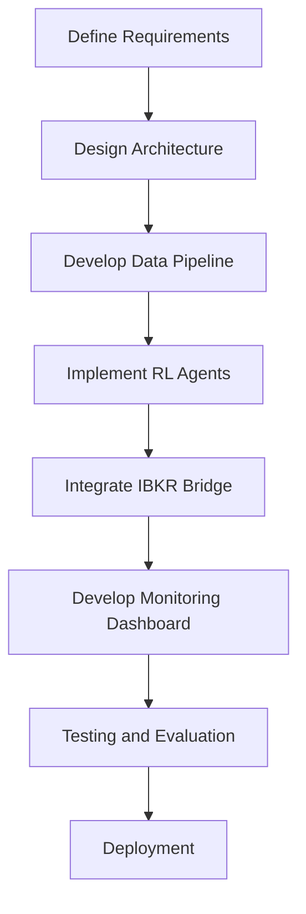

## 21. Additional UI Features (from HTML Mockup)

- **Global Kill Switch**: The UI includes a global emergency Kill Switch button for immediate system halt in critical situations.
- **Open Positions & Recent Trades**: The dashboard displays detailed sections for open positions (symbol, entry, P&L) and a table of recent trades (time, symbol, action, price, P&L).
- **Preset Settings**: Users can save, load, and reset configuration presets for agent and system settings directly from the UI.
- **LLM Selection**: The UI allows selection between different LLM providers (e.g., Perplexity, Gemini) for integration, if enabled.
- **TPU Selection Clarification**: TPU selection is available as a backend training option only; it is not required as a UI feature.
## 19. Advanced UI & Agent Controls

### Real-Time Status Display
- The UI will display real-time connection status for all critical components: IBKR Bridge, RL Agents, and Watchdog process. Status indicators will be visible and updated live in the dashboard.

### Agent Pause/Resume from UI
- The UI will provide controls to pause or resume each agent individually with a single click, allowing for safe intervention and management during live trading.

### Hot-Reload of Agent Settings
- The system will support hot-reload of agent configuration: changes to agent settings (e.g., risk limits, learning rate) can be applied without requiring a full system restart. The UI will indicate when changes are active.

### Multi-Agent Extensibility (for future growth)
- The current system supports two agents (stock and ETF). If you wish to add more agents in the future (e.g., for additional assets), ensure the following in the architecture and specification:
    - Agent management should be modular: each agent runs as an independent process or service.
    - The UI and backend should support dynamic discovery and control of multiple agents (not hardcoded to two).
    - Configuration files and logging should be agent-specific and scalable.
    - The monitoring and alerting system should aggregate and distinguish between multiple agents.
## 18. Hyperparameter Optimization (Integral Part)

Hyperparameter optimization is an essential, non-optional part of the model retraining workflow. The system will use Optuna (or a similar library) to automatically search for the best hyperparameters for each agent during every retraining cycle.

### Process Overview
- **Integration**: Hyperparameter tuning is executed as a mandatory step within the retraining workflow, not as an optional add-on.
- **Library**: Optuna will be used for efficient, automated hyperparameter search (e.g., learning rate, batch size, reward weights, network architecture).
- **Workflow**:
    1. Collect and merge new and historical data.
    2. Launch Optuna study to run multiple training trials with different hyperparameter sets.
    3. Evaluate each trial using backtesting and predefined performance metrics.
    4. Select the best-performing hyperparameter set and save the resulting model as the new version.
    5. Log all trial results and best parameters for audit and reproducibility.
- **Automation**: The entire process is automated and triggered as part of scheduled or manual retraining.
- **UI Integration**: Optionally, the UI can display the progress and results of the tuning process, but the optimization itself is always performed.

### Benefits
- Ensures optimal model performance over time without manual intervention.
- Adapts to changing data and market conditions.
- Provides transparency and reproducibility for all model updates.
## 17. TPU Training Support

The system will support training RL agents on TPUs (Tensor Processing Units) to accelerate deep learning workloads:

- **TPU Compatibility**: Training code and data pipelines must be compatible with major TPU providers (e.g., Google Cloud TPU).
- **Configuration**: Provide configuration options to select CPU, GPU, or TPU as the training backend.
- **Dependencies**: Ensure all required libraries (TensorFlow, JAX, or PyTorch with XLA) are supported and tested on TPU environments.
- **Scalability**: Training scripts should efficiently utilize TPU parallelism for faster convergence.
## 16. Alerting Integration (WhatsApp/Telegram)

To ensure critical events are communicated in real time, the system will support integration with messaging platforms:

- **Alert Channels**: Alerts can be sent via WhatsApp or Telegram (configurable).
- **Alert Types**: Includes drawdown breaches, IBKR connection loss, latency spikes, action stalls, and any other critical system events.
- **Message Content**: Alerts will include timestamp, event type, affected component, and relevant details for diagnosis.
- **Configuration**: Admins can configure which events trigger alerts and which channels are used.
# Core System Goals

The system is an autonomous trading platform based on Reinforcement Learning (RL).

- Two separate agents:
    - **PPO Agent** — for single stock trading.
    - **SAC Agent** — for leveraged ETF trading.
- Both agents operate under a single IBKR account, executing orders via a C# bridge.
- Real-time performance with a visual management interface (UI).

## 2. Agent Configuration

| Asset         | Algorithm | Environment    | Reward Function                                 | Model File             |
|---------------|-----------|---------------|-------------------------------------------------|------------------------|
| Stock         | PPO       | StockEnv.py    | Net return – penalty for drawdown                | ppo_stock_model.zip    |
| Leveraged ETF | SAC       | ETFEnv.py      | Risk-adjusted return – penalty for volatility    | sac_etf_model.zip      |

- Each agent is trained separately and operates independently.
- Retraining occurs periodically (weekly or monthly).
- Live trading data is collected to CSV and incorporated into the next training cycle.

## 15. Retraining Workflow

To ensure the agent remains effective in changing market conditions, the following retraining workflow will be implemented:

1. **New Data Collection**: Continuously collect new trading data from live operations.
2. **Data Integration**: Merge new data with existing historical datasets to form a comprehensive training set.
3. **Retraining**: Periodically retrain each agent using the updated dataset.
4. **Model Versioning**: Save each retrained model as a new version, maintaining a history of previous models for rollback if needed.
5. **Backtesting**: Evaluate the new model version on historical data to ensure performance improvements or stability.
6. **Redeployment**: Deploy the validated model to live trading if backtest results meet predefined criteria.
# RL Trading System - Specification Document

## Table of Contents
1. System Overview
2. Key Decisions and Rationale
3. System Architecture
4. Data Flow and Structure
5. Risk Management
6. State Normalization & Drift Handling
7. Evaluation Framework
8. Logging, Monitoring & Recovery
9. File Structure (Suggested)
10. Development Workflow
11. Flowchart
12. Technology Stack
13. Additional Notes
14. Final Decisions Summary

## 1. System Overview
This document specifies the architecture and requirements for a Reinforcement Learning (RL)-based trading system. The system is designed to support both stocks and ETFs, including leveraged ETFs, under a single brokerage account. It will utilize state-of-the-art RL algorithms, provide real-time monitoring, and integrate with Interactive Brokers (IBKR) via a C# bridge for optimal speed and stability.

## 2. Key Decisions and Rationale

| Topic | Decision/Requirement | Rationale |
|-------|---------------------|-----------|
| Environment (Gym) | Shared gym environment for both stocks and ETFs. | No need for separate environments; shared is sufficient and simplifies maintenance. |
| Account Structure | Both assets operate under a single brokerage account. | Simplifies management and aligns with broker capabilities. |
| RL Algorithms | PPO (Proximal Policy Optimization) for stocks; SAC (Soft Actor-Critic) for ETFs. | PPO is currently state-of-the-art for discrete actions; SAC is strong for continuous actions and fits ETF needs. |
| Model Usage | The same model is used for both training and live trading. | Ensures consistency between backtesting and production. |
| Data Logging | Log all agent decisions, actions, and performance for both training and monitoring. | Enables performance tracking, debugging, and compliance. |
| Input Data | Agent receives raw price data, technical indicators, news, and its own recent decisions and performance (e.g., last month). | Rich context improves learning and decision quality. |
| Data Format | Data must be formatted for compatibility with the training process. | Ensures smooth pipeline from data collection to training. |
| Leveraged ETFs (e.g., TNA) | Training on the underlying asset (e.g., IWM) is acceptable, but not strictly required. | Underlying asset often reflects leveraged ETF behavior; not mandatory but can be beneficial. |
| LLM Integration | Possible to integrate LLM APIs (Perplexity, Gemini) with RL, but only if it adds clear value. | LLMs may add noise; use only if they provide actionable insights. |
| Technology Stack | API and frontend should be chosen for best performance. C# bridge is required for IBKR integration. | C# bridge is fastest and most stable for IBKR; tech stack should not hinder agent performance. |
| IBKR Connection | Use the most stable and fast C# bridge for IBKR. | Ensures reliable and low-latency trading. |
| Monitoring | Real-time charting of the asset, including agent decisions (buy/sell points and reasoning), is a core feature. | Essential for transparency, debugging, and user trust. |
| Interface Language | Choose a frontend language that does not interfere with agent performance. | Flexibility in UI/UX without impacting core logic. |
| Development Steps | Start with high-level plan, then detail interface and backend steps. | Structured approach ensures completeness. |

### Additional Questions Addressed
- All agent decisions and rationales must be visible in real-time monitoring.
- No further critical features are required at this stage, unless new needs arise.
## 3. System Architecture

- **RL Agent**: Implements PPO for stocks and SAC for ETFs. Receives all relevant data and outputs actions.
- **Data Pipeline**: Collects and preprocesses raw prices, indicators, news, and agent history. Ensures data is in the correct format for the agent.
- **Training Module**: Trains the agent using historical and recent data, including its own past decisions and performance.
- **Execution Module**: Uses the trained model to make live trading decisions and send orders to IBKR via the C# bridge.
- **Monitoring Dashboard**: Real-time visualization of asset prices, agent actions (buy/sell), and the rationale for each decision.
- **IBKR Bridge**: C#-based integration for fast, stable order execution and data retrieval from Interactive Brokers.

## 4. Data Flow and Structure

### Data Pipeline

- **Input Features**: The agent receives as input:
    - Price
    - Volume
    - Technical indicators: RSI, MACD, EMA_10, EMA_50, VIX
    - Sentiment (optional)

- **Unified Data Structure**: All data is stored in a consistent format:
    - `timestamp, price, volume, rsi, macd, ema_10, ema_50, vix, sentiment, action, reward`

- **Live Data Source**: Real-time market data is streamed from IBKR Market Data via the C# bridge.
- **Offline Data Source (Yahoo Finance)**: The system supports fetching historical and pseudo-live data from Yahoo Finance (YF) for any asset. Data can be pulled at 1-minute, 5-minute, or 15-minute intervals to simulate live streaming. This is strictly for offline analysis, monitoring, and agent simulation (not for live trading).

- **Data Collection**:
    - Live agent data is saved to `agent_live_logs.csv`.
    - Before retraining, live logs are merged with `historical_data.csv` to create a comprehensive training dataset.
    - When using YF as a data source, the system can continuously fetch and stream data at the selected interval (1m/5m/15m), creating a "live" chart for any asset.
## 20. Offline Data Streaming & Agent Simulation

The system provides an offline simulation mode using Yahoo Finance (YF) data:

- **Data Streaming**: Users can select any asset and stream historical YF data at 1-minute, 5-minute, or 15-minute intervals, simulating a live market environment.
- **Live Charting**: The UI displays a real-time updating chart based on the streamed YF data, including all standard overlays (price, indicators, agent actions).
- **Agent Simulation**: While streaming YF data, users can activate any agent in simulation mode. The agent will trade on the pseudo-live data, and all actions, rewards, and performance metrics will be logged and visualized as in live trading.
- **Control**: Users can start/stop the YF data stream and simulation at any time from the UI.

- **Preprocessing**: Data is formatted and normalized for agent consumption.
- **Agent Output**: Action (buy/sell/hold), rationale, and confidence score.
- **Logged Data**: Timestamp, action, asset, price, reward, rationale, and performance metrics. All logs are used for both training feedback and monitoring.

## 5. Risk Management

Robust risk management is essential for any RL-based trading system. The following mechanisms will be implemented:

- **Position Sizing**: The agent will be constrained by maximum position size and exposure limits per asset and overall portfolio.
- **Stop-Loss & Take-Profit**: Automated stop-loss and take-profit logic will be enforced at both the agent and execution levels.
- **Drawdown Control**: The system will monitor rolling drawdown and can halt trading or reduce risk if thresholds are breached.
- **Leverage Limits**: Strict leverage controls will be applied, especially for leveraged ETFs.
- **Risk Metrics Logging**: All risk-related events and metrics will be logged for audit and analysis.

## 6. State Normalization & Drift Handling

To ensure stable learning and robust live performance, the following will be implemented:

- **Feature Normalization**: All input features (prices, indicators, sentiment, etc.) will be normalized (e.g., z-score, min-max) before being fed to the agent.
- **Online Normalization**: The system will support online normalization to adapt to changing market regimes.
- **Drift Detection**: Statistical tests and monitoring will be used to detect data distribution drift. If drift is detected, retraining or adaptation will be triggered.
- **Adaptive Retraining**: The agent can be retrained or fine-tuned automatically or manually in response to detected drift.

## 7. Evaluation Framework

Continuous evaluation is critical for RL agent reliability:

- **Backtesting**: The agent will be evaluated on historical data before live deployment.
- **Paper Trading**: A paper trading mode will be available for live simulation without real capital risk.
- **Performance Metrics**: Key metrics (Sharpe, Sortino, max drawdown, win rate, etc.) will be tracked and visualized.
- **A/B Testing**: Multiple agent versions can be evaluated in parallel to select the best performer.
- **Reward Attribution**: The system will log and analyze reward attribution for each action to improve transparency.

## 8. Logging, Monitoring & Recovery

Robust logging and monitoring are essential for diagnosing issues, auditing, and ensuring system reliability. The following are mandatory:

- **Real-Time Logging**: All system components (API, IBKR Bridge, RL Agents) must produce real-time logs.
- **Rolling Logs**: Logs are saved as rolling files with precise timestamps to allow for historical tracing and efficient storage management.
- **Live Metrics**: The system will track and visualize key metrics, including:
    - Equity curve (account value over time)
    - Reward per episode/step
    - Action frequency (how often each action is taken)
    - Position exposure (current and historical)
- **Alerting**: Automated alerts will be triggered for:
    - Daily drawdown breaches
    - Loss of connection to IBKR Gateway
    - Latency spikes or action stalls (unusually slow agent or system response)
- **Comprehensive Logging**: All actions, states, rewards, rationales, and risk events are logged for full traceability.
- **Real-Time Monitoring**: The dashboard visualizes price, agent actions, features, policy confidence, rewards, and all live metrics above.
- **Failover & Recovery**: The system will include mechanisms for automatic failover and recovery:
    - **State Checkpointing**: Regular saving of agent state and environment for quick recovery (see also Safe State Restart below).
    - **Redundancy**: Critical components will have redundancy to minimize downtime.
    - **Graceful Degradation**: In case of partial failure, the system will degrade gracefully (e.g., halt trading, switch to safe mode).
    - **Recovery Procedures**: Documented and automated recovery steps for rapid restoration after failure.

### IB Gateway Auto-Reconnect (C#)
- The IBKR C# bridge will attempt to reconnect to IB Gateway every 10 seconds until successful if the connection is lost.
- The system will detect stuck orders and automatically cancel any order that is not confirmed within a reasonable timeout.

### Restart Safe State (Python)
- The agent will save a snapshot of its latest state (e.g., `state.json`) every few seconds.
- On restart, the system will load the last saved state and resume from that point, minimizing loss of context.

### Watchdog Process
- A separate watchdog process will monitor the health of both the IBKR bridge and the RL agents.
- If either process fails or becomes unresponsive, the watchdog will automatically restart it.

## 9. File & Directory Structure (Production-Grade)

The project will use a modular, production-grade structure with small, focused files for flexibility and maintainability. UI tabs/components and large functions will be separated for clarity and control.

### Root
- `/agent/` — RL agent implementations (PPO, SAC)
- `/data/` — Data collection and preprocessing scripts
- `/training/` — Training scripts and configuration
- `/execution/` — Live trading and execution logic
- `/monitoring/` — Dashboard and visualization tools
- `/ibkr_bridge/` — C# bridge code for IBKR
- `/system/` — System-level utilities (e.g., `watchdog.py`)
- `/utils/` — Utility modules (e.g., `state_snapshot.py`)
- `/config/` — Configuration files
- `/frontend/` — React app (UI)

### Frontend (React)
- `/frontend/src/`
    - `/components/` — Small, focused React components
        - `TabDashboard.jsx` — Dashboard tab
        - `TabAgentControl.jsx` — Agent control tab
        - `TabLogs.jsx` — Logs/monitoring tab
        - `TabSettings.jsx` — Settings tab
        - `TabDataExplorer.jsx` — Data Explorer tab for selecting data source (IBKR/YF), streaming YF data, and running agent simulations
        - ... (each tab as a separate file)
    - `/functions/` — Large or complex UI functions, each in its own file
    - `/styles/` — Design and style files (see next section for design guidelines)
    - `App.jsx` — Main app entry
    - `index.js` — React entry point

### Example Utility/Logic Files
- `/agent/ppo_agent.py`
- `/agent/sac_agent.py`
- `/training/retrain.py`
- `/monitoring/equity_curve.py`
- `/monitoring/alerts.py`
- `/utils/merge_logs.py`

All files should be as small and modular as possible for easy maintenance and extension.

## 10. Agent Settings Configurability

The system will provide a configuration interface (UI and backend) to adjust key parameters for each agent, such as:
- Learning rate
- Reward function weights
- Risk limits (max position, stop-loss, etc.)
- Retraining frequency
- Feature selection (enable/disable sentiment, indicators, etc.)

Settings can be changed via the UI (e.g., in `TabSettings.jsx`) and are stored in `/config/agent_settings.json` or a similar file. Changes are applied dynamically or on the next agent restart, as appropriate.

## 10. Development Workflow

### High-Level Steps
1. **Define Requirements**: Clarify all business and technical needs.
2. **Design Architecture**: Plan system modules, data flow, and integration points.
3. **Develop Data Pipeline**: Implement data collection, preprocessing, and formatting.
4. **Implement RL Agents**: Build PPO and SAC agents with required input/output structure.
5. **Integrate IBKR Bridge**: Set up C# bridge for order execution and data retrieval.
6. **Develop Monitoring Dashboard**: Real-time visualization of prices, agent actions, and rationales.
7. **Testing and Evaluation**: Backtest, log, and monitor agent performance.
8. **Deployment**: Launch live trading and monitoring.

- The frontend will be implemented exclusively in React to ensure consistency and maintainability.
- Ensure API/backend is optimized for speed and reliability.
- Integrate with the C# IBKR bridge for all trading operations.

## 11. Flowchart

- **Backend/API**: Python (only) for all backend services, data pipelines, and training scripts.
- **API Protocol**: REST API (preferred) for all communication between frontend, backend, and C# bridge. WebSocket can be added in the future for real-time needs.
- **Data Storage**: CSV/JSON files for logs, training data, and configuration. If data volume or complexity increases, migration to a database (e.g., PostgreSQL or MongoDB) will be considered.
- **Deployment**: Local environment initially, with Docker-based configuration to allow easy migration to cloud or other servers in the future.
- **Version Control**: GitHub for all code and configuration management.
- **Frontend**: React (only) for all user interface components.
- **IBKR Integration**: C# bridge for fastest, most stable connection.
- **LLM Integration**: Optional; only if it provides clear, actionable value.

## 13. Additional Notes
- Real-time monitoring with agent decision rationale is a core feature, not just "nice to have".
- All agent actions, rationales, and performance must be logged and visualized.
- No further critical features are required at this stage unless new needs arise.

## 14. Final Decisions Summary
- Shared gym environment for all assets.
- Single brokerage account for both stocks and ETFs.
- PPO for stocks, SAC for ETFs.
- Same model for training and live trading.
- Log all agent actions, rationales, and performance.
- Input data includes prices, indicators, news, and agent history.
- Training on underlying asset for leveraged ETFs is optional.
- LLM integration is possible but not required.
- C# bridge is mandatory for IBKR.
- Real-time monitoring and visualization is required.
- All decisions above are final unless new requirements arise.

*Prepared: November 7, 2025*
