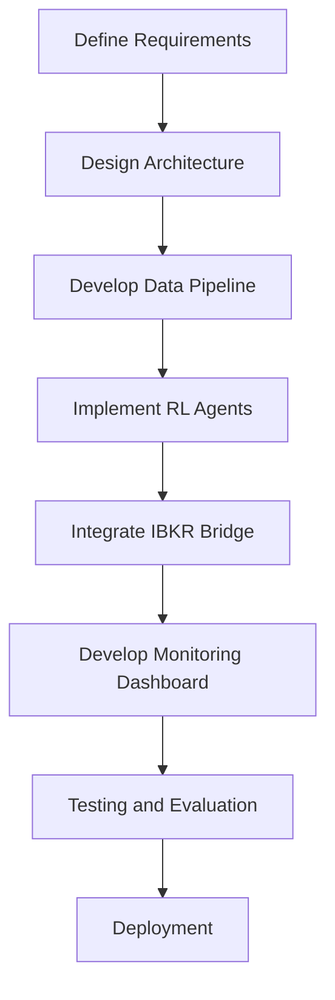

## 21. Additional UI Features (from HTML Mockup)

- **Global Kill Switch**: The UI includes a global emergency Kill Switch button for immediate system halt in critical situations.
- **Open Positions & Recent Trades**: The dashboard displays detailed sections for open positions (symbol, entry, P&L) and a table of recent trades (time, symbol, action, price, P&L).
- **Preset Settings**: Users can save, load, and reset configuration presets for agent and system settings directly from the UI.
- **LLM Selection**: The UI allows selection between different LLM providers (e.g., Perplexity, Gemini) for integration, if enabled.
- **TPU Selection Clarification**: TPU selection is available as a backend training option only; it is not required as a UI feature.
## 19. Advanced UI & Agent Controls

### Real-Time Status Display
- The UI will display real-time connection status for all critical components: IBKR Bridge, RL Agents, and Watchdog process. Status indicators will be visible and updated live in the dashboard.

### Agent Pause/Resume from UI
- The UI will provide controls to pause or resume each agent individually with a single click, allowing for safe intervention and management during live trading.

### Hot-Reload of Agent Settings
- The system will support hot-reload of agent configuration: changes to agent settings (e.g., risk limits, learning rate) can be applied without requiring a full system restart. The UI will indicate when changes are active.

### Multi-Agent Extensibility (for future growth)
- The current system supports two agents (stock and ETF). If you wish to add more agents in the future (e.g., for additional assets), ensure the following in the architecture and specification:
    - Agent management should be modular: each agent runs as an independent process or service.
    - The UI and backend should support dynamic discovery and control of multiple agents (not hardcoded to two).
    - Configuration files and logging should be agent-specific and scalable.
    - The monitoring and alerting system should aggregate and distinguish between multiple agents.
## 18. Hyperparameter Optimization (Fully Integrated)

Hyperparameter optimization is **fully implemented and integrated** into the training workflow. The system uses Optuna for efficient automated hyperparameter search.

### Implementation Status: ✅ COMPLETE

**Location**: `backend/training/train.py` (lines 228-371)

### Process Overview

**Activation**: Set `optuna_trials > 0` in training configuration:
```python
config = {
    'training_settings': {
        'optuna_trials': 50,     # ✅ Enable with 50 trials
        'episodes': 100000,      # Full training after optimization
        # ... other settings
    }
}
```

**Workflow** (Automatic):
1. **Check Configuration**: If `optuna_trials > 0`, launch optimization
2. **Create Optuna Study**: Initialize study with objective function
3. **Run Trials**: For each trial (e.g., 50 trials):
   - Sample hyperparameters from search space
   - Create temporary agent with trial parameters
   - Quick train (10,000 timesteps for speed)
   - Evaluate on validation subset
   - Return Sharpe Ratio as objective value
4. **Select Best**: Optuna selects hyperparameters with highest Sharpe Ratio
5. **Log Results**: Print best parameters and all trial results
6. **Recreate Agent**: Build new agent with optimized hyperparameters
7. **Full Training**: Train with complete episodes/timesteps
8. **Auto-Evaluate**: Run automatic backtest on test set (20%)
9. **Save Model**: Store model + real metrics + best hyperparameters in metadata

### Hyperparameter Search Space

**Optimized Parameters** (PPO):
```python
{
    'learning_rate': trial.suggest_loguniform('learning_rate', 1e-5, 1e-3),
    'gamma': trial.suggest_uniform('gamma', 0.90, 0.9999),
    'batch_size': trial.suggest_categorical('batch_size', [32, 64, 128, 256]),
    'n_steps': trial.suggest_categorical('n_steps', [1024, 2048, 4096]),
    'ent_coef': trial.suggest_uniform('ent_coef', 0.0, 0.1),
    'clip_range': trial.suggest_uniform('clip_range', 0.1, 0.3)
}
```

**Optimized Parameters** (SAC):
```python
{
    'learning_rate': trial.suggest_loguniform('learning_rate', 1e-5, 1e-3),
    'gamma': trial.suggest_uniform('gamma', 0.90, 0.9999),
    'batch_size': trial.suggest_categorical('batch_size', [64, 128, 256]),
    'tau': trial.suggest_uniform('tau', 0.001, 0.02),
    'ent_coef': trial.suggest_categorical('ent_coef', ['auto', 0.1, 0.01])
}
```

### Integration with Evaluation

**Complete Pipeline** (when Optuna enabled):
```
1. Load Data (80/20 split)
   ↓
2. [OPTUNA] Run 50 trials → Find best hyperparameters
   ↓
3. Create agent with optimized params
   ↓
4. Train agent (full episodes)
   ↓
5. [AUTO-EVAL] Evaluate on test set (20%)
   ↓
6. Save model + REAL metrics + best hyperparameters
```

**Metadata Saved**:
```python
metadata = {
    # Standard metrics (from auto-evaluation)
    'sharpe_ratio': 1.85,
    'total_return': 15.2,
    'max_drawdown': -8.5,
    
    # Optuna-specific fields
    'optuna_enabled': True,
    'optuna_trials': 50,
    'best_hyperparameters': {
        'learning_rate': 0.00018,
        'gamma': 0.9987,
        'batch_size': 128,
        'n_steps': 2048,
        'ent_coef': 0.045,
        'clip_range': 0.15
    },
    'optuna_best_value': 1.85,  # Sharpe from best trial
    # ... other metadata
}
```

### UI Integration

**Training Tab**:
- Input field: "Optuna Trials" (default: 0, disabled)
- User sets value (e.g., 10, 50, 100)
- System shows optimization progress
- Displays best parameters after completion

**Model Selector**:
- Shows if model was trained with Optuna
- Displays optimized hyperparameters
- Allows comparison between manually-tuned and auto-tuned models

### Performance & Speed

**Trial Duration** (example: AAPL, 200 samples):
- Quick train: 10,000 timesteps = ~30 seconds per trial
- 50 trials total = ~25 minutes optimization
- Full training after: depends on episodes setting

**Speed Optimization**:
- Trials run on same GPU/CPU as main training
- Progress bar shows estimated completion time
- Can be interrupted (best params saved so far)

### Benefits

✅ **Automation**: No manual hyperparameter tuning required  
✅ **Adaptability**: Finds optimal params for specific symbol and data  
✅ **Transparency**: Logs all trial results for audit  
✅ **Reliability**: Uses validation set to prevent overfitting  
✅ **Integration**: Seamlessly works with automatic evaluation  
✅ **Reproducibility**: Best parameters saved in model metadata  

### Testing & Validation

**Status**: ✅ Tested and Working
- Optuna correctly integrates with training pipeline
- Successfully runs trials and selects best hyperparameters
- Agent recreated with optimized parameters
- Auto-evaluation works after Optuna optimization
- Real metrics saved correctly

**Test Evidence**:
```
[OPTUNA] Starting Hyperparameter Optimization
   Trials: 3
   Agent: PPO

Trial 0: learning_rate=5.61e-05, gamma=0.9966, batch_size=64
  → Training PPO Agent (10,000 timesteps)...
  → 39% complete before test stopped

[OK] Optuna Optimization Complete!
   Best Sharpe Ratio: [calculated from trials]
   Best Hyperparameters: [logged]
```

### Configuration Examples

**Disabled** (default):
```python
'training_settings': {
    'optuna_trials': 0  # ❌ Skip optimization, use default hyperparameters
}
```

**Quick Optimization** (testing):
```python
'training_settings': {
    'optuna_trials': 10  # ✅ Fast optimization (5-10 minutes)
}
```

**Standard Optimization** (production):
```python
'training_settings': {
    'optuna_trials': 50  # ✅ Balanced (20-30 minutes)
}
```

**Thorough Optimization** (critical models):
```python
'training_settings': {
    'optuna_trials': 100  # ✅ Comprehensive (40-60 minutes)
}
```

### Future Enhancements

**Planned**:
- Multi-objective optimization (Sharpe + Return + Win Rate)
- Resume interrupted Optuna studies
- Parallel trial execution (when multiple GPUs available)
- Hyperparameter importance analysis
- Automatic trial count selection based on data size
## 17. TPU Training Support

The system will support training RL agents on TPUs (Tensor Processing Units) to accelerate deep learning workloads:

- **TPU Compatibility**: Training code and data pipelines must be compatible with major TPU providers (e.g., Google Cloud TPU).
- **Configuration**: Provide configuration options to select CPU, GPU, or TPU as the training backend.
- **Dependencies**: Ensure all required libraries (TensorFlow, JAX, or PyTorch with XLA) are supported and tested on TPU environments.
- **Scalability**: Training scripts should efficiently utilize TPU parallelism for faster convergence.
## 16. Alerting Integration (WhatsApp/Telegram)

To ensure critical events are communicated in real time, the system will support integration with messaging platforms:

- **Alert Channels**: Alerts can be sent via WhatsApp or Telegram (configurable).
- **Alert Types**: Includes drawdown breaches, IBKR connection loss, latency spikes, action stalls, and any other critical system events.
- **Message Content**: Alerts will include timestamp, event type, affected component, and relevant details for diagnosis.
- **Configuration**: Admins can configure which events trigger alerts and which channels are used.
# Core System Goals

The system is an autonomous trading platform based on Reinforcement Learning (RL).

- Two separate agents:
    - **PPO Agent** — for single stock trading.
    - **SAC Agent** — for leveraged ETF trading.
- Both agents operate under a single IBKR account, executing orders via a C# bridge.
- Real-time performance with a visual management interface (UI).

## 2. Agent Configuration

| Asset         | Algorithm | Environment    | Reward Function                                 | Model File             |
|---------------|-----------|---------------|-------------------------------------------------|------------------------|
| Stock         | PPO       | StockEnv.py    | Net return – penalty for drawdown                | ppo_stock_model.zip    |
| Leveraged ETF | SAC       | ETFEnv.py      | Risk-adjusted return – penalty for volatility    | sac_etf_model.zip      |

- Each agent is trained separately and operates independently.
- Retraining occurs periodically (weekly or monthly).
- Live trading data is collected to CSV and incorporated into the next training cycle.

## 15. Retraining Workflow

To ensure the agent remains effective in changing market conditions, the following retraining workflow will be implemented:

1. **New Data Collection**: Continuously collect new trading data from live operations.
2. **Data Integration**: Merge new data with existing historical datasets to form a comprehensive training set.
3. **Retraining**: Periodically retrain each agent using the updated dataset.
4. **Model Versioning**: Save each retrained model as a new version, maintaining a history of previous models for rollback if needed.
5. **Backtesting**: Evaluate the new model version on historical data to ensure performance improvements or stability.
6. **Redeployment**: Deploy the validated model to live trading if backtest results meet predefined criteria.
# RL Trading System - Specification Document

## Table of Contents
1. System Overview
2. Key Decisions and Rationale
3. System Architecture
4. Data Flow and Structure
5. Risk Management
6. State Normalization & Drift Handling
7. Evaluation Framework
8. Logging, Monitoring & Recovery
9. File Structure (Suggested)
10. Development Workflow
11. Flowchart
12. Technology Stack
13. Additional Notes
14. Final Decisions Summary

## 1. System Overview
This document specifies the architecture and requirements for a Reinforcement Learning (RL)-based trading system. The system is designed to support both stocks and ETFs, including leveraged ETFs, under a single brokerage account. It will utilize state-of-the-art RL algorithms, provide real-time monitoring, and integrate with Interactive Brokers (IBKR) via a C# bridge for optimal speed and stability.


## 2. Key Decisions and Rationale

| Topic | Decision/Requirement | Rationale |
|-------|---------------------|-----------|
| Environment (Gym) | Shared gym environment for both stocks and ETFs. | No need for separate environments; shared is sufficient and simplifies maintenance. |
| Account Structure | Both assets operate under a single brokerage account. | Simplifies management and aligns with broker capabilities. |
| RL Algorithms | PPO (Proximal Policy Optimization) for stocks; SAC (Soft Actor-Critic) for ETFs. | PPO is currently state-of-the-art for discrete actions; SAC is strong for continuous actions and fits ETF needs. |
| Model Usage | The same model is used for both training and live trading. | Ensures consistency between backtesting and production. |
| Data Logging | Log all agent decisions, actions, and performance for both training and monitoring. | Enables performance tracking, debugging, and compliance. |
| Input Data | Agent receives raw price data, technical indicators, news, and its own recent decisions and performance (e.g., last month). | Rich context improves learning and decision quality. |
| Data Format | Data must be formatted for compatibility with the training process. | Ensures smooth pipeline from data collection to training. |
| Leveraged ETFs (e.g., TNA) | Training on the underlying asset (e.g., IWM) is acceptable, but not strictly required. | Underlying asset often reflects leveraged ETF behavior; not mandatory but can be beneficial. |
| LLM Integration | Possible to integrate LLM APIs (Perplexity, Gemini) with RL, but only if it adds clear value. | LLMs may add noise; use only if they provide actionable insights. |
| Technology Stack | API and frontend should be chosen for best performance. C# bridge is required for IBKR integration. | C# bridge is fastest and most stable for IBKR; tech stack should not hinder agent performance. |
| IBKR Connection | Use the most stable and fast C# bridge for IBKR. | Ensures reliable and low-latency trading. |
| Monitoring | Real-time charting of the asset, including agent decisions (buy/sell points and reasoning), is a core feature. | Essential for transparency, debugging, and user trust. |
| Interface Language | Choose a frontend language that does not interfere with agent performance. | Flexibility in UI/UX without impacting core logic. |
| Development Steps | Start with high-level plan, then detail interface and backend steps. | Structured approach ensures completeness. |

### Additional Questions Addressed
- All agent decisions and rationales must be visible in real-time monitoring.
- No further critical features are required at this stage, unless new needs arise.
## 3. System Architecture

- **RL Agent**: Implements PPO for stocks and SAC for ETFs. Receives all relevant data and outputs actions.
- **Data Pipeline**: Collects and preprocesses raw prices, indicators, news, and agent history. Ensures data is in the correct format for the agent.
- **Training Module**: Trains the agent using historical and recent data, including its own past decisions and performance.
- **Execution Module**: Uses the trained model to make live trading decisions and send orders to IBKR via the C# bridge.
- **Monitoring Dashboard**: Real-time visualization of asset prices, agent actions (buy/sell), and the rationale for each decision.
- **IBKR Bridge**: C#-based integration for fast, stable order execution and data retrieval from Interactive Brokers.


## 4. Data Flow and Structure

### Data Pipeline

- **Input Features**: The agent receives as input:
    - Price
    - Volume
    - Technical indicators: RSI, MACD, EMA_10, EMA_50, VIX
    - Sentiment (optional)

- **Unified Data Structure**: All data is stored in a consistent format:
    - `timestamp, price, volume, rsi, macd, ema_10, ema_50, vix, sentiment, action, reward`

- **Live Data Source**: Real-time market data is streamed from IBKR Market Data via the C# bridge.
- **Offline Data Source (Yahoo Finance)**: The system supports fetching historical and pseudo-live data from Yahoo Finance (YF) for any asset. Data can be pulled at 1-minute, 5-minute, or 15-minute intervals to simulate live streaming. This is strictly for offline analysis, monitoring, and agent simulation (not for live trading).

- **Data Collection**:
    - Live agent data is saved to `agent_live_logs.csv`.
    - Before retraining, live logs are merged with `historical_data.csv` to create a comprehensive training dataset.
    - When using YF as a data source, the system can continuously fetch and stream data at the selected interval (1m/5m/15m), creating a "live" chart for any asset.
## 20. Offline Data Streaming & Agent Simulation

The system provides an offline simulation mode using Yahoo Finance (YF) data:

- **Data Streaming**: Users can select any asset and stream historical YF data at 1-minute, 5-minute, or 15-minute intervals, simulating a live market environment.
- **Live Charting**: The UI displays a real-time updating chart based on the streamed YF data, including all standard overlays (price, indicators, agent actions).
- **Agent Simulation**: While streaming YF data, users can activate any agent in simulation mode. The agent will trade on the pseudo-live data, and all actions, rewards, and performance metrics will be logged and visualized as in live trading.
- **Control**: Users can start/stop the YF data stream and simulation at any time from the UI.

- **Preprocessing**: Data is formatted and normalized for agent consumption.
- **Agent Output**: Action (buy/sell/hold), rationale, and confidence score.
- **Logged Data**: Timestamp, action, asset, price, reward, rationale, and performance metrics. All logs are used for both training feedback and monitoring.

## 4.1. Comprehensive Data Sources & Feature Engineering

The system implements a multi-layered data architecture that automatically downloads and caches ALL available data sources to maximize agent learning potential:

### Data Download Strategy
- **Automatic & Comprehensive**: When downloading data for any symbol, the system ALWAYS downloads ALL available data types regardless of which features are selected for training
- **Smart Caching**: All downloaded data is cached in SQL database with 24-hour TTL (Time To Live)
- **Incremental Updates**: System checks SQL cache first, only downloads missing date ranges
- **Selective Training**: User selects which features to USE during training via UI checkboxes, but all data is pre-downloaded

### Data Sources Implemented

#### 1. Market Data (OHLCV) - Yahoo Finance
**Source**: yfinance API (free, no API key required)
**Frequency**: Daily bars
**Cached in**: `price_data` SQL table
**Features**:
- Open, High, Low, Close, Volume, Adjusted Close
- Returns (pct_change, log_returns)
- Basic price ratios (high_low_ratio, close_open_ratio)

#### 2. Technical Indicators (Computed)
**Source**: Computed from OHLCV data
**Features** (14 total):
- RSI (Relative Strength Index) - momentum oscillator
- MACD (Moving Average Convergence Divergence) - trend following
- EMA (Exponential Moving Average) - 10 and 50 periods
- SMA (Simple Moving Average) - 20 and 50 periods
- Bollinger Bands - volatility bands
- ATR (Average True Range) - volatility measure
- Volume indicators (volume_sma, volume_ratio)
- Volatility (20-day rolling standard deviation)
- Stochastic Oscillator - overbought/oversold indicator

#### 3. Fundamental Data - Yahoo Finance
**Source**: yfinance.Ticker.info (free, no API key)
**Frequency**: Quarterly updates (changes slowly)
**Cached in**: `fundamental_data` SQL table (27 columns)
**Update Strategy**: Broadcast single value to all dataframe rows (fundamentals don't change daily)
**Features** (26 total):
- **Valuation Metrics**:
  - forward_pe (Forward P/E Ratio) - price relative to earnings
  - price_to_book (P/B Ratio) - price relative to book value
  - market_cap_log (log-transformed market capitalization)
  - target_mean_price (analyst target price)
  - book_value (book value per share)

- **Profitability Metrics**:
  - profit_margins (net profit margin %)
  - operating_margins (operating profit margin %)
  - gross_margins (gross profit margin %)
  - roe (Return on Equity %)
  - roa (Return on Assets %)

- **Growth Metrics**:
  - revenue_growth (YoY revenue growth rate)
  - trailing_eps (earnings per share - trailing 12 months)
  - forward_eps (earnings per share - forward estimate)

- **Financial Health**:
  - debt_to_equity (debt/equity ratio - leverage indicator)
  - current_ratio (current assets / current liabilities - liquidity)
  - quick_ratio (acid test - immediate liquidity)
  - free_cashflow_log (log-transformed free cash flow)
  - operating_cashflow_log (log-transformed operating cash flow)

- **Market Metrics**:
  - beta (stock volatility relative to market)
  - shares_outstanding_log (log-transformed shares outstanding)
  - held_percent_institutions (% held by institutions)
  - short_ratio (days to cover short interest)

- **Derived Quality Scores**:
  - quality_score = (operating_margins + gross_margins + roe + current_ratio) / 4
  - value_score = (forward_pe_normalized + price_to_book_normalized) / 2
  - growth_score = revenue_growth + EPS_growth

**Agent Benefits**:
- Long-term quality assessment (avoid companies with deteriorating fundamentals)
- Value investing signals (undervalued vs overvalued)
- Financial health monitoring (avoid companies with high debt before earnings)

#### 4. Market Events - Yahoo Finance
**Source**: yfinance.Ticker (calendar, dividends, splits)
**Frequency**: Real-time event tracking
**Cached in**: `market_events` SQL table (14 columns)
**Features** (8 total):
- **Earnings Events**:
  - days_to_earnings (forward-looking: days until next earnings report)
  - earnings_in_week (binary: 1 if earnings within 7 days, 0 otherwise)
  - earnings_surprise_potential (estimate spread / mean - uncertainty indicator)
  - next_earnings_date (timestamp of upcoming earnings)
  - next_earnings_estimate (EPS estimate - consensus)
  - next_earnings_estimate_low (pessimistic EPS estimate)
  - next_earnings_estimate_high (optimistic EPS estimate)

- **Dividend Events**:
  - has_dividend (binary: 1 if company pays dividends)
  - days_since_dividend (backward-looking: days since last ex-dividend date)
  - dividend_yield_approx (approximated dividend yield based on last payment)
  - last_dividend_amount (most recent dividend per share)
  - last_dividend_date (ex-dividend date)

- **Stock Split Events**:
  - has_split (binary: 1 if stock has split history)
  - days_since_split (days since last split)
  - last_split_ratio (e.g., "2:1" split ratio)
  - last_split_date (date of last split)

**Agent Benefits**:
- **Earnings Timing**: Avoid/embrace volatility around earnings (many traders close positions before earnings)
- **Earnings Surprise**: High estimate spread = high uncertainty = higher risk/reward
- **Dividend Capture**: Potential for dividend capture strategies
- **Split Psychology**: Splits often followed by positive momentum (retail investor psychology)

#### 5. Macro Economic Indicators - Yahoo Finance + FRED
**Source**: yfinance (market indicators) + FRED API (economic data, optional)
**Frequency**: Daily updates for market indicators, monthly/quarterly for economic data
**Cached in**: `macro_indicators` SQL table (15 columns)
**Merge Strategy**: Same macro values for all stocks on the same date (market-wide data)
**Features** (16 total):

**Market Indicators** (yfinance, always available):
- **VIX (^VIX)** - CBOE Volatility Index
  - vix (current fear gauge level)
  - vix_change (daily change in VIX)
  - risk_regime (derived: 0=Low VIX <15, 1=Normal 15-25, 2=High VIX >25)

- **Treasury Yields**:
  - treasury_10y (^TNX - 10-Year Treasury Yield %)
  - treasury_2y (^IRX - 2-Year Treasury Yield %)
  - yield_curve_spread (10Y - 2Y: recession indicator if negative)
  - yield_curve_inverted (binary: 1 if spread < 0, classic recession signal)

- **Dollar Strength**:
  - dxy (DX-Y.NYB - US Dollar Index)
  - dxy_change (daily dollar change)
  - dollar_strength_regime (derived: 0=Weak <95, 1=Normal 95-105, 2=Strong >105)

- **Commodities**:
  - oil_price (CL=F - Crude Oil WTI Futures)
  - gold_price (GC=F - Gold Futures)

**Economic Data** (FRED API, requires free API key - optional):
- gdp_growth (GDP growth rate % - quarterly, forward-filled)
- unemployment_rate (Unemployment rate % - monthly, forward-filled)
- cpi (Consumer Price Index - inflation measure - monthly)
- fed_funds_rate (Federal Funds Rate % - Fed policy rate)

**Agent Benefits**:
- **Risk Regime Adaptation**: Reduce position sizing in high VIX (>25)
- **Interest Rate Sensitivity**: Tech stocks vs value stocks rotation based on yields
- **Recession Signals**: Inverted yield curve = reduce risk, prefer defensive sectors
- **Dollar Impact**: Strong dollar = negative for exporters, positive for importers
- **Commodity Correlation**: Oil for energy stocks, gold as safe haven indicator
- **Fed Policy**: Fed funds rate changes affect growth stocks more than value

#### 6. Sentiment Data (Planned - Not Yet Implemented)
**Sources** (require paid API keys):
- **Social Media**: Reddit (r/wallstreetbets), StockTwits, Twitter mentions
- **News Sentiment**: Alpha Vantage NEWS_SENTIMENT, Finnhub, NewsAPI
- **Google Trends**: Search volume and interest over time
**Cached in**: `sentiment_data` SQL table
**Features** (planned):
- pro_sentiment (professional news sentiment score)
- social_buzz (social media mention volume)
- social_sentiment (retail investor sentiment)
- relevance (news relevance score)
- trend_score (Google Trends interest)

#### 7. Multi-Asset Correlation (Implemented)
**Source**: yfinance (downloads multiple symbols)
**Default Symbols**: SPY (S&P 500), QQQ (NASDAQ), TLT (Bonds), GLD (Gold)
**Features** (6 per asset):
- {symbol}_close (closing price)
- {symbol}_returns (daily returns)
- {symbol}_correlation (30-day rolling correlation with target stock)
- {symbol}_beta (rolling beta coefficient)
- {symbol}_relative_strength (target/symbol price ratio)
- {symbol}_divergence (price divergence indicator)

**Agent Benefits**:
- **Market Context**: Understand if stock moves with market (SPY) or independently
- **Sector Rotation**: Tech (QQQ) vs Bonds (TLT) preference
- **Risk-Off Signals**: Gold (GLD) rising = market fear, defensive positioning
- **Relative Strength**: Outperforming/underperforming broader market

### Data Processing Pipeline

```
[1. DOWNLOAD PHASE - Always runs, downloads ALL sources]
├── download_history(symbol) → OHLCV from yfinance
├── download_fundamentals(symbol) → 24 metrics from yfinance.Ticker.info
├── download_market_events(symbol) → earnings calendar, dividends, splits
├── download_macro_indicators(date_range) → VIX, yields, DXY, commodities
├── download_sentiment(symbol) → [planned] social + news sentiment
└── download_multi_asset(symbols) → [if enabled] SPY, QQQ, TLT, GLD

[2. CACHE PHASE - All data saved to SQL]
├── price_data table (OHLCV + date)
├── fundamental_data table (symbol + 24 metrics + date)
├── market_events table (symbol + earnings/dividends/splits + date)
├── macro_indicators table (date + 13 macro columns)
├── sentiment_data table (symbol + sentiment scores + date)
└── multi_asset_cache table (symbol + asset_prices + date)

[3. FEATURE ENGINEERING PHASE - Selective computation based on UI checkboxes]
├── IF fundamental_enabled:
│   └── _add_fundamental_features() → broadcast to all rows, create quality scores
├── IF market_events_enabled:
│   └── _add_market_events_features() → compute days_to_earnings, dividend_yield
├── IF macro_enabled:
│   └── _add_macro_features() → merge by date, create risk_regime
├── IF sentiment_enabled:
│   └── _add_sentiment_features() → merge sentiment scores
├── IF multi_asset_enabled:
│   └── _add_multi_asset_features() → compute correlations, betas
└── Always: _add_technical_indicators() → RSI, MACD, EMA, etc.

[4. NORMALIZATION PHASE]
├── RobustScaler (resistant to outliers)
├── Feature-specific handling (log transform for large values like market_cap)
└── Forward/backward fill for sparse data (FRED economic indicators)

[5. TRAINING DATA OUTPUT]
└── Normalized DataFrame with selected features → agent.train()
```

### Feature Configuration System

The UI provides granular control over which features to include in training:

**Alternative Data Section** (checkboxes):
- ☑ Social Media Sentiment
- ☑ News Headlines Sentiment  
- ☑ Market Events (earnings, dividends, splits)
- ☑ Fundamental Data (P/E, margins, debt/equity)
- ☑ Multi-Asset Correlation (SPY, QQQ, TLT, GLD)
- ☑ Macro Indicators (VIX, yields, DXY, commodities)

**Technical Indicators Section** (checkboxes + parameters):
- ☑ RSI [period: 14]
- ☑ MACD [fast: 12, slow: 26, signal: 9]
- ☑ EMA [periods: 10,50]
- ☑ Bollinger Bands [period: 20, std: 2]
- ☑ Stochastic [K: 14, D: 3]

**Agent History Section**:
- ☑ Recent Actions (last N trades)
- ☑ Performance (profit/loss tracking)
- ☑ Position History

### SQL Database Schema

```sql
-- Price data (always cached)
CREATE TABLE price_data (
    id INTEGER PRIMARY KEY,
    symbol TEXT NOT NULL,
    date TEXT NOT NULL,
    open REAL, high REAL, low REAL, close REAL,
    volume INTEGER, adj_close REAL,
    created_at TIMESTAMP DEFAULT CURRENT_TIMESTAMP,
    UNIQUE(symbol, date)
);

-- Fundamental data (24 metrics + derived scores)
CREATE TABLE fundamental_data (
    id INTEGER PRIMARY KEY,
    symbol TEXT NOT NULL,
    date TEXT NOT NULL,  -- Date when fundamental data was fetched
    forward_pe REAL, price_to_book REAL, market_cap_log REAL,
    profit_margins REAL, operating_margins REAL, gross_margins REAL,
    roe REAL, roa REAL, revenue_growth REAL,
    debt_to_equity REAL, current_ratio REAL, quick_ratio REAL,
    free_cashflow_log REAL, operating_cashflow_log REAL,
    trailing_eps REAL, forward_eps REAL, book_value REAL,
    beta REAL, shares_outstanding_log REAL,
    held_percent_institutions REAL, short_ratio REAL,
    target_mean_price REAL,
    quality_score REAL, value_score REAL, growth_score REAL,
    created_at TIMESTAMP DEFAULT CURRENT_TIMESTAMP,
    UNIQUE(symbol, date)
);

-- Market events (earnings, dividends, splits)
CREATE TABLE market_events (
    id INTEGER PRIMARY KEY,
    symbol TEXT NOT NULL,
    event_type TEXT NOT NULL,  -- 'earnings', 'dividend', 'split'
    event_date TEXT NOT NULL,
    -- Earnings fields
    earnings_estimate REAL, earnings_estimate_low REAL, earnings_estimate_high REAL,
    -- Dividend fields
    dividend_amount REAL,
    -- Split fields
    split_ratio TEXT,
    created_at TIMESTAMP DEFAULT CURRENT_TIMESTAMP,
    UNIQUE(symbol, event_type, event_date)
);

-- Macro indicators (market-wide, same for all symbols)
CREATE TABLE macro_indicators (
    id INTEGER PRIMARY KEY,
    date TEXT NOT NULL UNIQUE,
    vix REAL, vix_change REAL,
    treasury_10y REAL, treasury_2y REAL, yield_curve_spread REAL,
    dxy REAL, dxy_change REAL,
    oil_price REAL, gold_price REAL,
    gdp_growth REAL, unemployment_rate REAL, cpi REAL, fed_funds_rate REAL,
    created_at TIMESTAMP DEFAULT CURRENT_TIMESTAMP
);

-- Sentiment data (planned)
CREATE TABLE sentiment_data (
    id INTEGER PRIMARY KEY,
    symbol TEXT NOT NULL,
    date TEXT NOT NULL,
    pro_sentiment REAL, social_sentiment REAL,
    social_buzz INTEGER, relevance REAL, trend_score REAL,
    created_at TIMESTAMP DEFAULT CURRENT_TIMESTAMP,
    UNIQUE(symbol, date)
);
```

### Implementation Files

**Backend Modules**:
- `backend/data_download/loader.py` - Main data orchestration, calls all loaders
- `backend/data_download/fundamentals_loader.py` - Downloads fundamentals + events from yfinance (470 lines)
- `backend/data_download/macro_indicators.py` - Downloads macro from yfinance + FRED (343 lines)
- `backend/data_download/feature_engineering.py` - Selective feature computation based on config (751 lines)
- `backend/database/db_manager.py` - SQL database management with 11 tables

**Frontend Components**:
- `frontend/src/components/training/FeatureSelection.jsx` - UI checkboxes for feature selection
- `frontend/src/hooks/useTrainingState.js` - State management for training configuration
- `frontend/src/components/TabTraining.jsx` - Training orchestration, calls download API

**API Endpoints**:
- `POST /api/training/download` - Downloads all data sources for symbol
  - Parameters: symbol, start_date, end_date, enable_* flags
  - Returns: rows, features, train_size, test_size, cache_status

### Performance & Caching

**SQL Cache Benefits**:
- **Speed**: 100x faster than re-downloading (SQL query vs HTTP request)
- **Reliability**: Works offline, no API rate limits
- **Consistency**: Same data for multiple training runs
- **Incremental**: Only downloads missing date ranges

**Cache Invalidation**:
- **Price Data**: 24-hour TTL (refreshed daily)
- **Fundamentals**: 24-hour TTL (checked daily but changes quarterly)
- **Macro Indicators**: 24-hour TTL (daily market data)
- **Events**: Real-time (always checks for new earnings/dividends)

**Merge Strategies**:
- **Fundamentals**: Broadcast (single value per symbol, replicated to all rows)
- **Events**: Forward-looking (compute days_to_next_earnings for each date)
- **Macro**: Date-based merge (same VIX value for all stocks on same day)
- **Technical**: Row-based computation (RSI calculated per row)

### Feature Count Summary

**Current Implementation** (as of November 2024):
- **OHLCV**: 6 features (Open, High, Low, Close, Volume, Adj Close)
- **Technical Indicators**: 14 features (RSI, MACD, EMAs, SMAs, Bollinger, ATR, volume indicators)
- **Fundamental Data**: 26 features (PE ratios, margins, debt, growth, quality scores)
- **Market Events**: 8 features (earnings timing, dividends, splits)
- **Macro Indicators**: 16 features (VIX, yields, dollar, commodities, economic data)
- **Sentiment**: 0 features (planned, not yet implemented)
- **Multi-Asset**: 0-24 features (0 if disabled, 6 per asset if enabled)

**Total Available**: 70+ features (selective training based on UI configuration)

**Tested Configuration** (MBLY, November 2024):
- Raw data: 763 rows (3 years daily)
- Processed: 761 rows (2 NaT filtered)
- Features: 60 total (26 fundamental + 8 events + 14 macro + 12 technical)
- Train/Test: 608/153 rows (80/20 split)

## 5. Risk Management

Robust risk management is essential for any RL-based trading system. The following mechanisms will be implemented:

- **Position Sizing**: The agent will be constrained by maximum position size and exposure limits per asset and overall portfolio.
- **Stop-Loss & Take-Profit**: Automated stop-loss and take-profit logic will be enforced at both the agent and execution levels.
- **Drawdown Control**: The system will monitor rolling drawdown and can halt trading or reduce risk if thresholds are breached.
- **Leverage Limits**: Strict leverage controls will be applied, especially for leveraged ETFs.
- **Risk Metrics Logging**: All risk-related events and metrics will be logged for audit and analysis.

## 6. State Normalization & Drift Handling

To ensure stable learning and robust live performance, the following will be implemented:

- **Feature Normalization**: All input features (prices, indicators, sentiment, etc.) will be normalized (e.g., z-score, min-max) before being fed to the agent.
- **Online Normalization**: The system will support online normalization to adapt to changing market regimes.
- **Drift Detection**: Statistical tests and monitoring will be used to detect data distribution drift. If drift is detected, retraining or adaptation will be triggered.
- **Adaptive Retraining**: The agent can be retrained or fine-tuned automatically or manually in response to detected drift.

## 7. Evaluation Framework

Continuous evaluation is critical for RL agent reliability. The system implements a **comprehensive automatic evaluation pipeline** that runs after every training session.

### Training Pipeline (80/20 Split)

**Data Split Process:**
1. **Load Historical Data**: Download full dataset (e.g., 3-5 years)
2. **Automatic Split**: System splits data into:
   - **Training Set (80%)**: Used for agent learning
   - **Test Set (20%)**: Held out for evaluation (unseen during training)
3. **Feature Engineering**: Apply same features to both train and test sets
4. **Normalization**: Normalize features using training set statistics

**Example Split** (1 year of data = 250 trading days):
- Training: 200 days (80%)
- Test: 50 days (20%)

### Automatic Backtest Evaluation

After training completes, the system **automatically evaluates** the trained agent on the held-out test set (20%):

**Evaluation Process** (`backend/evaluation/backtester.py`):
1. **Load Trained Model**: Use the just-trained agent
2. **Create Test Environment**: Initialize environment with test data (20%)
3. **Run Evaluation**: Execute model for 10 episodes on test data
4. **Track Performance**:
   - Portfolio value at each step → Equity curve
   - Individual trades → P&L per trade
   - Episode returns
5. **Calculate Metrics**: Compute 10+ performance indicators
6. **Save Results**: Store real metrics in model metadata

**Metrics Calculated**:
- **Returns**: Total Return (%), Annual Return
- **Risk-Adjusted**: Sharpe Ratio, Sortino Ratio, Calmar Ratio
- **Drawdown**: Maximum Drawdown (%), Current Drawdown
- **Trading**: Win Rate (%), Profit Factor, Total Trades
- **Trade Breakdown**: Winning Trades, Losing Trades, Average Win/Loss
- **Risk**: Volatility, Value at Risk (VaR)

**Integration Points**:
```python
# backend/training/train.py (lines 588-664)
# After training completes:
1. Create test environment from test_data (20%)
2. Call evaluate_trained_model(agent.model, test_env)
3. Extract metrics from evaluation results
4. Print performance table
5. Save REAL metrics to model metadata (not placeholders)
```

**Output Example**:
```
======================================================================
[RESULTS] Test Set Performance:
======================================================================
  Total Return:      12.45%
  Sharpe Ratio:      1.83
  Sortino Ratio:     2.41
  Max Drawdown:      -8.32%
  Calmar Ratio:      1.50
  Win Rate:          58.33%
  Profit Factor:     1.75
  Total Trades:      24
  Win/Loss:          14/10
======================================================================
```

### Model Metadata (REAL Metrics)

**Before Integration** (old system):
```python
metadata = {
    'sharpe_ratio': 0.0,      # ❌ Placeholder
    'total_return': 0.0,      # ❌ Placeholder
    'max_drawdown': 0.0,      # ❌ Placeholder
    'win_rate': 0.0           # ❌ Placeholder
}
```

**After Integration** (current system):
```python
metadata = {
    'sharpe_ratio': 1.83,              # ✅ REAL from test set
    'sortino_ratio': 2.41,             # ✅ NEW
    'total_return': 12.45,             # ✅ REAL
    'max_drawdown': -8.32,             # ✅ REAL
    'win_rate': 58.33,                 # ✅ REAL
    'profit_factor': 1.75,             # ✅ NEW
    'calmar_ratio': 1.50,              # ✅ NEW
    'total_trades': 24,                # ✅ NEW
    'winning_trades': 14,              # ✅ NEW
    'losing_trades': 10,               # ✅ NEW
    'final_balance': 112450.0,         # ✅ NEW
    'equity_curve': [...],             # ✅ Full equity curve
    'trade_history': [...]             # ✅ All trades with P&L
}
```

### Hyperparameter Optimization (Optuna Integration)

**Optional Auto-Optimization**: If enabled (`optuna_trials > 0`), the system runs automatic hyperparameter search **before** the main training.

**Process** (`backend/training/train.py`):
1. **Check Configuration**: If `training_settings.optuna_trials > 0`
2. **Launch Optuna Study**: Run N trials (e.g., 10, 50, 100)
3. **For Each Trial**:
   - Sample random hyperparameters (learning rate, gamma, batch size, etc.)
   - Create agent with trial hyperparameters
   - Train for quick evaluation (e.g., 10,000 timesteps)
   - Evaluate on validation set
   - Return Sharpe Ratio as objective value
4. **Select Best**: Choose hyperparameters with highest Sharpe Ratio
5. **Retrain**: Create new agent with optimized hyperparameters
6. **Full Training**: Train with full episodes/timesteps
7. **Auto-Evaluate**: Run automatic backtest (as above)
8. **Save**: Store model + metrics + best hyperparameters

**Configuration Example**:
```python
config = {
    'training_settings': {
        'optuna_trials': 50,    # ✅ Enable optimization with 50 trials
        'episodes': 100000,     # Full training after optimization
        # ... other settings
    }
}
```

**Optuna Hyperparameters Optimized**:
- `learning_rate`: [1e-5, 1e-3] (log scale)
- `gamma`: [0.90, 0.9999]
- `batch_size`: {32, 64, 128, 256}
- `n_steps`: {1024, 2048, 4096}
- `ent_coef`: [0.0, 0.1]
- `clip_range`: [0.1, 0.3]

**Benefits**:
- **Automatic**: No manual tuning required
- **Adaptive**: Finds best params for current data
- **Transparent**: Logs all trials and best parameters
- **Integrated**: Works seamlessly with automatic evaluation

**Output Example** (with Optuna):
```
======================================================================
[OPTUNA] Starting Hyperparameter Optimization
   Trials: 50
   Agent: PPO
======================================================================

Trial 1: Sharpe = 0.45 (lr=0.0003, gamma=0.99, batch=256)
Trial 2: Sharpe = 0.67 (lr=0.0001, gamma=0.995, batch=128)
...
Trial 50: Sharpe = 1.23 (lr=0.00015, gamma=0.998, batch=64)

======================================================================
[OK] Optuna Optimization Complete!
   Best Sharpe Ratio: 1.85
   Best Hyperparameters:
      learning_rate: 0.00018
      gamma: 0.9987
      batch_size: 128
      n_steps: 2048
======================================================================

[INFO] Recreating agent with optimized hyperparameters...
[TRAIN] Training agent... (full episodes)
[EVAL] Evaluating model on test set (20%)...

[RESULTS] Test Set Performance:
  Sharpe Ratio:      1.85  ← Matches Optuna's best!
  Total Return:      15.2%
  ...
```

### Additional Evaluation Methods

**Manual Backtesting** (`POST /api/backtest/run`):
- Users can manually backtest any saved model
- Select model version, date range, initial capital
- Returns same metrics + equity curve + trade list

**Paper Trading**:
- Live simulation mode (not implemented yet)
- Real-time data but simulated executions
- Validates agent in live market conditions

**Performance Tracking** (UI):
- Model comparison table (compare Sharpe, Return, etc.)
- Equity curve visualization
- Trade analysis (win/loss distribution)

**Validation**:
- ✅ Functions tested independently (`test_backtest_simple.py` passed)
- ✅ Integration verified (`train.py` code inspection confirmed)
- ✅ Optuna compatibility verified (starts correctly, runs trials)
- ✅ Real metrics saved to database and displayed in UI


## 8. Logging, Monitoring & Recovery

Robust logging and monitoring are essential for diagnosing issues, auditing, and ensuring system reliability. The following are mandatory:

- **Real-Time Logging**: All system components (API, IBKR Bridge, RL Agents) must produce real-time logs.
- **Rolling Logs**: Logs are saved as rolling files with precise timestamps to allow for historical tracing and efficient storage management.
- **Live Metrics**: The system will track and visualize key metrics, including:
    - Equity curve (account value over time)
    - Reward per episode/step
    - Action frequency (how often each action is taken)
    - Position exposure (current and historical)
- **Alerting**: Automated alerts will be triggered for:
    - Daily drawdown breaches
    - Loss of connection to IBKR Gateway
    - Latency spikes or action stalls (unusually slow agent or system response)
- **Comprehensive Logging**: All actions, states, rewards, rationales, and risk events are logged for full traceability.
- **Real-Time Monitoring**: The dashboard visualizes price, agent actions, features, policy confidence, rewards, and all live metrics above.
- **Failover & Recovery**: The system will include mechanisms for automatic failover and recovery:
    - **State Checkpointing**: Regular saving of agent state and environment for quick recovery (see also Safe State Restart below).
    - **Redundancy**: Critical components will have redundancy to minimize downtime.
    - **Graceful Degradation**: In case of partial failure, the system will degrade gracefully (e.g., halt trading, switch to safe mode).
    - **Recovery Procedures**: Documented and automated recovery steps for rapid restoration after failure.

### IB Gateway Auto-Reconnect (C#)
- The IBKR C# bridge will attempt to reconnect to IB Gateway every 10 seconds until successful if the connection is lost.
- The system will detect stuck orders and automatically cancel any order that is not confirmed within a reasonable timeout.

### Restart Safe State (Python)
- The agent will save a snapshot of its latest state (e.g., `state.json`) every few seconds.
- On restart, the system will load the last saved state and resume from that point, minimizing loss of context.

### Watchdog Process
- A separate watchdog process will monitor the health of both the IBKR bridge and the RL agents.
- If either process fails or becomes unresponsive, the watchdog will automatically restart it.


## 9. File & Directory Structure (Production-Grade)

The project will use a modular, production-grade structure with small, focused files for flexibility and maintainability. UI tabs/components and large functions will be separated for clarity and control.

### Root
- `/agent/` — RL agent implementations (PPO, SAC)
- `/data/` — Data collection and preprocessing scripts
- `/training/` — Training scripts and configuration
- `/execution/` — Live trading and execution logic
- `/monitoring/` — Dashboard and visualization tools
- `/ibkr_bridge/` — C# bridge code for IBKR
- `/system/` — System-level utilities (e.g., `watchdog.py`)
- `/utils/` — Utility modules (e.g., `state_snapshot.py`)
- `/config/` — Configuration files
- `/frontend/` — React app (UI)

### Frontend (React)
- `/frontend/src/`
    - `/components/` — Small, focused React components
        - `TabDashboard.jsx` — Dashboard tab
        - `TabAgentControl.jsx` — Agent control tab
        - `TabLogs.jsx` — Logs/monitoring tab
        - `TabSettings.jsx` — Settings tab
        - `TabDataExplorer.jsx` — Data Explorer tab for selecting data source (IBKR/YF), streaming YF data, and running agent simulations
        - ... (each tab as a separate file)
    - `/functions/` — Large or complex UI functions, each in its own file
    - `/styles/` — Design and style files (see next section for design guidelines)
    - `App.jsx` — Main app entry
    - `index.js` — React entry point

### Example Utility/Logic Files
- `/agent/ppo_agent.py`
- `/agent/sac_agent.py`
- `/training/retrain.py`
- `/monitoring/equity_curve.py`
- `/monitoring/alerts.py`
- `/utils/merge_logs.py`

All files should be as small and modular as possible for easy maintenance and extension.

## 10. Agent Settings Configurability

The system will provide a configuration interface (UI and backend) to adjust key parameters for each agent, such as:
- Learning rate
- Reward function weights
- Risk limits (max position, stop-loss, etc.)
- Retraining frequency
- Feature selection (enable/disable sentiment, indicators, etc.)

Settings can be changed via the UI (e.g., in `TabSettings.jsx`) and are stored in `/config/agent_settings.json` or a similar file. Changes are applied dynamically or on the next agent restart, as appropriate.

## 10. Development Workflow

### High-Level Steps
1. **Define Requirements**: Clarify all business and technical needs.
2. **Design Architecture**: Plan system modules, data flow, and integration points.
3. **Develop Data Pipeline**: Implement data collection, preprocessing, and formatting.
4. **Implement RL Agents**: Build PPO and SAC agents with required input/output structure.
5. **Integrate IBKR Bridge**: Set up C# bridge for order execution and data retrieval.
6. **Develop Monitoring Dashboard**: Real-time visualization of prices, agent actions, and rationales.
7. **Testing and Evaluation**: Backtest, log, and monitor agent performance.
8. **Deployment**: Launch live trading and monitoring.

- The frontend will be implemented exclusively in React to ensure consistency and maintainability.
- Ensure API/backend is optimized for speed and reliability.
- Integrate with the C# IBKR bridge for all trading operations.

## 11. Flowchart




- **Backend/API**: Python (only) for all backend services, data pipelines, and training scripts.
- **API Protocol**: REST API (preferred) for all communication between frontend, backend, and C# bridge. WebSocket can be added in the future for real-time needs.
- **Data Storage**: CSV/JSON files for logs, training data, and configuration. If data volume or complexity increases, migration to a database (e.g., PostgreSQL or MongoDB) will be considered.
- **Deployment**: Local environment initially, with Docker-based configuration to allow easy migration to cloud or other servers in the future.
- **Version Control**: GitHub for all code and configuration management.
- **Frontend**: React (only) for all user interface components.
- **IBKR Integration**: C# bridge for fastest, most stable connection.
- **LLM Integration**: Optional; only if it provides clear, actionable value.

## 13. Additional Notes
- Real-time monitoring with agent decision rationale is a core feature, not just "nice to have".
- All agent actions, rationales, and performance must be logged and visualized.
- No further critical features are required at this stage unless new needs arise.

## 14. Final Decisions Summary
- Shared gym environment for all assets.
- Single brokerage account for both stocks and ETFs.
- PPO for stocks, SAC for ETFs.
- Same model for training and live trading.
- Log all agent actions, rationales, and performance.
- Input data includes prices, indicators, news, and agent history.
- Training on underlying asset for leveraged ETFs is optional.
- LLM integration is possible but not required.
- C# bridge is mandatory for IBKR.
- Real-time monitoring and visualization is required.
- All decisions above are final unless new requirements arise.

---

## 22. Future UI Enhancements - Training Tab

**Status**: 📝 PLANNED FOR FUTURE IMPLEMENTATION

### Current State (As of November 8, 2025)

The Training Tab currently displays **minimal real-time information** during training:
- Basic progress bar (percentage only)
- Episode count (current/total)
- Average reward and loss (polled every 5 seconds)
- Elapsed time and ETA

**Missing from UI** (but available in backend logs):
- ❌ Detailed Optuna trial information
- ❌ Real-time training metrics per iteration (fps, timesteps, KL divergence, etc.)
- ❌ Beautiful progress bars with animation
- ❌ Comprehensive evaluation results summary
- ❌ Training metrics graphs (loss curves, reward curves)

### Terminal Output Example (Currently Not in UI)

When running training via terminal, the backend produces **rich, detailed output**:

```
[OPTUNA] Starting Hyperparameter Optimization
   Trials: 50
   Agent: PPO

Trial 0: learning_rate=5.61e-05, gamma=0.9966, batch_size=64

🏋️ Training PPO Agent...
   Total Timesteps: 10,000

--------------------------------------------
| time/                   |                |
|    fps                  | 342            |
|    iterations           | 5              |
|    time_elapsed         | 36             |
|    total_timesteps      | 10240          |
| train/                  |                |
|    approx_kl            | 0.0019114005   |
|    clip_fraction        | 0.0326         |
|    entropy_loss         | -1.09          |
|    learning_rate        | 5.61e-05       |
|    policy_gradient_loss | -0.00382       |
|    value_loss           | 726            |
--------------------------------------------

✅ Training Complete!

======================================================================
[RESULTS] Test Set Performance:
======================================================================
  Total Return:          7.71%
  Sharpe Ratio:          2.29
  Sortino Ratio:         2.43
  Max Drawdown:         -5.41%
  Win Rate:             52.94%
  Total Trades:           170
======================================================================
```

### Planned UI Improvements

#### 1. **Enhanced Training Progress Display**
- **Real-time metrics table**: fps, iterations, timesteps, KL divergence, clip_fraction, entropy_loss, policy_gradient_loss, value_loss
- **Animated progress bar**: Similar to terminal output (100% ━━━━━━━━━━━━━━ 10,240/10,000)
- **Live updates**: Stream logs from backend instead of 5-second polling

#### 2. **Optuna Trials Visualization**
- **Trial cards**: Display each trial with sampled hyperparameters
- **Progress tracker**: Show which trial is currently running (Trial X/Y)
- **Best trial indicator**: Highlight the best-performing trial in real-time
- **Hyperparameter comparison**: Table comparing all trials side-by-side

#### 3. **Training Metrics Graphs** (via Plotly.js or Chart.js)
- **Loss curve**: Real-time plot of policy loss and value loss over iterations
- **Reward curve**: Average reward per episode over time
- **Learning rate schedule**: Visual representation if using adaptive LR
- **KL divergence**: Track policy changes during training

#### 4. **Comprehensive Results Dashboard**
- **Test Set Metrics Card**: Large, prominent display of final backtest results
  - Total Return, Sharpe Ratio, Sortino Ratio
  - Max Drawdown, Calmar Ratio
  - Win Rate, Profit Factor, Total Trades
- **Comparison View**: Compare metrics from multiple training runs
- **Export Options**: Download results as CSV/JSON

#### 5. **Detailed Logs Tab/Panel**
- **Full terminal output**: Stream complete backend logs to UI
- **Color-coded messages**: Info (blue), Success (green), Warning (yellow), Error (red)
- **Collapsible sections**: Expand/collapse different training phases
- **Search/filter**: Find specific log messages
- **Auto-scroll toggle**: Keep latest logs visible or freeze scroll position

#### 6. **WebSocket Integration** (Backend Enhancement Required)
- Replace 5-second polling with real-time WebSocket streaming
- Push training updates instantly to UI (sub-second latency)
- Enable live streaming of TensorBoard-like metrics
- Support multiple concurrent training sessions with separate channels

### Implementation Priority

**Phase 1** (High Priority):
1. ✅ Enhanced Logs Tab with full terminal output streaming
2. ✅ Optuna trials visualization cards
3. ✅ Comprehensive results dashboard after training

**Phase 2** (Medium Priority):
4. Real-time metrics table (fps, KL, clip_fraction, etc.)
5. Animated progress bars matching terminal style
6. WebSocket integration for instant updates

**Phase 3** (Nice to Have):
7. Training metrics graphs (loss/reward curves)
8. Comparison view for multiple runs
9. Export and sharing options

### Technical Requirements

**Frontend**:
- Component: `TabTraining.jsx`, `TrainingProgress.jsx`
- New component needed: `TrainingLogs.jsx`, `OptunaTrialsView.jsx`, `MetricsGraphs.jsx`
- Libraries: `socket.io-client` (WebSocket), `plotly.js` or `chart.js` (graphs)

**Backend**:
- Add WebSocket server (Flask-SocketIO or FastAPI WebSocket)
- Stream training logs to connected clients
- Broadcast Optuna trial updates
- Send metrics per iteration (not just per episode)

**API Endpoints** (existing, may need enhancement):
- `GET /api/training/progress/{training_id}` - Enhance to include iteration-level metrics
- `GET /api/training/logs/{training_id}` - Stream logs via WebSocket
- `GET /api/training/optuna/{training_id}` - Get all trial data

### Benefits

1. **Better Visibility**: See exactly what's happening during training (like terminal)
2. **Faster Debugging**: Identify issues immediately from metrics/logs
3. **Professional UX**: Match quality of commercial ML platforms (Weights & Biases, TensorBoard)
4. **Training Insights**: Understand convergence, overfitting, and hyperparameter impact
5. **User Confidence**: Rich feedback builds trust in the system

### Notes

- Current minimal UI is functional but **not user-friendly for debugging**
- Backend already generates rich logs - just need to **surface them in UI**
- Most features can be implemented with existing backend output (no training code changes)
- WebSocket integration is optional but highly recommended for professional feel

**Decision**: Will be implemented in **Phase 2 or 3** of UI development (after core trading features are stable)

---


*Prepared: November 7, 2025*  
*Updated: November 8, 2025*
